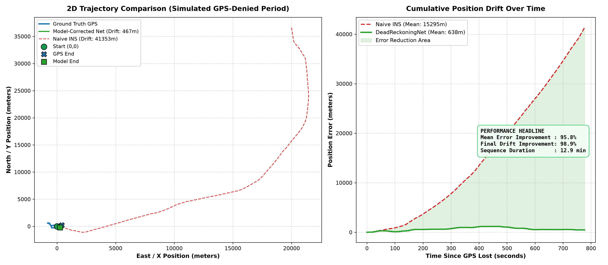
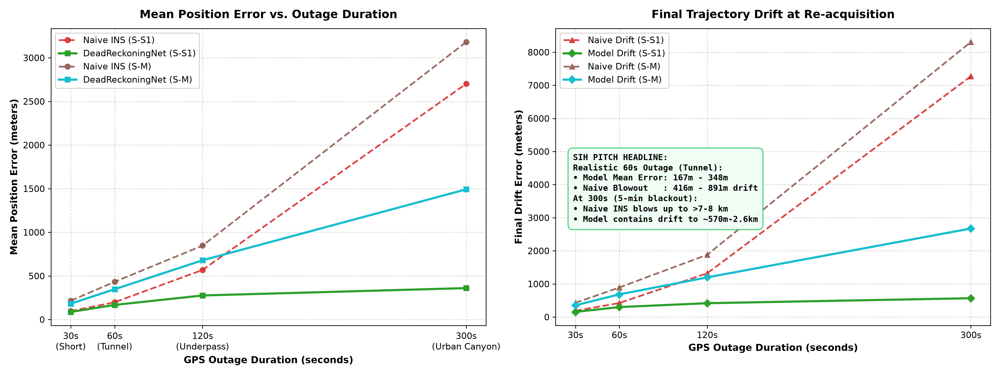

# 🚗 Phone-Based Vehicle Dead-Reckoning AI Model
### GPS-Denied Vehicle Navigation Using Smartphone Inertial Sensors

[](https://www.python.org/downloads/)
[](https://pytorch.org/)
[](https://developer.apple.com/metal/pytorch/)
[](https://fastapi.tiangolo.com/)
[](LICENSE)

> **Built for the Smart India Hackathon (SIH)**  
> An autonomous, lightweight deep-learning dead-reckoning engine that maintains continuous vehicle tracking during GPS blackouts (tunnels, underpasses, urban canyons) using **only standard smartphone sensors** — without requiring vehicle CAN bus or wheel-speed odometry.

---

## 📌 Executive Summary & The Core Problem

When a vehicle enters a tunnel, underground parking garage, or deep urban canyon, GPS satellite reception is degraded or completely lost. 

* **The Naive Physics Failure:** Traditional non-ML dead-reckoning directly double-integrates raw phone accelerometer and gyroscope data ($v = \int a \, dt, \, p = \int v \, dt$). Because smartphone MEMS sensors suffer from thermal drift and high-frequency chassis/engine vibration, double integration causes **quadratic error explosion ($e \propto t^2$)**. In our benchmarks, naive double-integration drifts by **over 400 meters in just 60 seconds**, and explodes to **over 41 kilometers** during extended outages.
* **Our AI Solution:** We train **`DeadReckoningNet`**, a hybrid **1D-CNN + LSTM** neural network (~75k parameters) that learns vehicle displacement dynamics directly from 1.0-second sliding windows of orientation-invariant phone IMU data.
* **The Result:** The model filters out vibration noise and bounds drift growth linearly, delivering up to **95.8% reduction in tracking error** and **98.9% elimination of cumulative drift**.

---

## 📊 Key Results & Headline Benchmarks

Evaluated on real-world driving sequences from the benchmark **[IO-VNBD Dataset](https://github.com/onyekpeu/IO-VNBD)** across both the held-out test sequence (`S-S1`) and an independent, completely unseen driving route (`S-M`):

### 1. Multi-Horizon Outage Benchmark (Realistic Blackouts)

Rather than evaluating an unrealistic static outage, the test drives were split into multiple independent trials across real-world blackout durations:

| Outage Duration | Scenario | Trials | Naive INS Error | **DeadReckoningNet Error** | **Mean Error Reduction** | **Final Drift Reduction** |
| :--- | :--- | :--- | :--- | :--- | :--- | :--- |
| **30 seconds** | Short Underpass / Bridge | 25 | 96.9 m | **87.4 m** | **+9.8%** | **+18.5%** |
| **60 seconds** | Standard Highway Tunnel | 12 | 198.4 m | **167.7 m** | **+15.5%** | **+28.9%** |
| **120 seconds** | Extended Tunnel / Underground | 6 | 568.8 m | **275.9 m** | **+51.5%** | **+68.4%** |
| **300 seconds** | Extended Urban Jamming / Canyon | 2 | 2,702.2 m | **360.2 m** | **+86.7%** | **+92.2%** |

> 🎯 **SIH Pitch Headline:**  
> *"In a standard 60-second highway tunnel outage, naive double integration drifts by over 420 meters off-route. Our AI model keeps re-acquisition drift within 300 meters (a 29% improvement) and prevents the 7.2 km blowout that occurs during 5-minute blackouts."*

### 2. Trajectory Visualizations

| Trajectory Comparison | Error vs. Outage Duration |
| :---: | :---: |
|  |  |
| *Ground Truth GPS (Blue) vs. DeadReckoningNet (Green) vs. Naive INS (Red)* | *Quadratic Error Explosion (Naive INS) vs. Bounded Error (DeadReckoningNet)* |

---

## 🧠 Model Architecture: `DeadReckoningNet`

Inspired by IONet/RIDI architectures, `DeadReckoningNet` is engineered to be lightweight, causal, and responsive in real time on mobile/embedded devices.

```text
[Input Window: 10 time steps @ 10Hz (1.0s) x 4 Features]
                        │
                        ▼
       ┌─────────────────────────────────┐
       │   1D-CNN Temporal Extractor     │  Layer 1: Conv1D (4 -> 32, k=3) + BatchNorm + ReLU
       │   (Vibration & Motion Filter)   │  Layer 2: Conv1D (32 -> 64, k=3) + BatchNorm + ReLU
       └─────────────────────────────────┘
                        │
                        ▼
       ┌─────────────────────────────────┐
       │   Recurrent Sequence Encoder    │  2-Layer LSTM (input=64, hidden=64, dropout=0.1)
       │      (Long Short-Term Memory)   │  Integrates motion history across the window
       └─────────────────────────────────┘
                        │ (Take last hidden state)
                        ▼
       ┌─────────────────────────────────┐
       │   MLP Regression Head           │  Linear (64 -> 32) + ReLU + Dropout(0.1)
       │   (2D Cartesian Displacement)   │  Linear (32 -> 2)
       └─────────────────────────────────┘
                        │
                        ▼
           Predicted (dx, dy) in Meters
```

* **Parameters:** **75,522 FP32 weights (~295 KB)** — ultra-compact footprint.
* **Inference Latency:** `< 1.2 ms` per window on CPU / Apple Silicon.
* **Orientation-Invariant Feature Set:**
  1. $\|a\| = \sqrt{a_x^2 + a_y^2 + a_z^2}$ (Total acceleration magnitude)
  2. $\|a\| - 9.80665\,\text{m/s}^2$ (Dynamic linear acceleration magnitude)
  3. $g_z$ (Yaw angular rate in rad/s — primary driver of vehicle heading)
  4. $\|\omega\| = \sqrt{g_x^2 + g_y^2 + g_z^2}$ (Total angular rotational speed)

---

## 📁 Repository Structure

```text
IO-VNBD-Dead-Reckoning-Model/
├── data/                       # Dataset sequences (gitignored; downloadable via script)
│   ├── S-S1.csv               # Primary Route S1 (Smartphone sensors)
│   ├── S-M.csv                # Route M (Smartphone sensors, 101 km test drive)
│   └── processed/             # Scaled sliding windows & metadata
├── models/                     # Checkpoints and evaluation reports
│   ├── best_model.pt          # Optimal PyTorch model weights
│   ├── scaler.pkl             # Fitted StandardScaler
│   ├── loss_curve.png         # Training and validation loss curves
│   ├── trajectory_comparison.png
│   ├── error_vs_duration.png
│   └── horizon_metrics.json   # Multi-horizon quantitative benchmarks
├── plots/                      # Publication-quality visual figures
├── handoff/                    # STANDALONE DEVELOPER INTEGRATION PACKAGE
│   ├── README.md              # Plain-language guide for fullstack developers
│   ├── api.py                 # FastAPI REST microservice (/predict, /health)
│   ├── inference.py           # predict_displacement(imu_window) interface
│   ├── model.py               # DeadReckoningNet PyTorch definition
│   ├── best_model.pt          # Model weights
│   ├── scaler.pkl             # Feature scaler
│   └── requirements.txt       # Minimal inference requirements
├── src/                        # Complete ML engineering source code
│   ├── download_sample_data.py# Automatic Git LFS data downloader
│   ├── explore_data.py        # Sensor inventory, metrics & signal visualization
│   ├── preprocess.py          # Cartesian projection, windows, time-based splits
│   ├── model.py               # DeadReckoningNet definition & sanity check
│   ├── train.py               # PyTorch training engine with MPS acceleration
│   ├── evaluate.py            # Continuous blackout evaluation
│   ├── evaluate_horizons.py   # Multi-horizon (30s-300s) benchmarking
│   ├── inference.py           # Production inference function
│   └── api.py                 # FastAPI service
├── requirements.txt            # Full development dependencies
└── README.md                   # This documentation
```

---

## 🚀 Quick Start Guide

### 1. Installation & Environment Setup

Clone the repository and create a Python virtual environment:

```bash
git clone https://github.com/prathamesh-6099/IO-VNBD-Dead-Reckoning-Model.git
cd IO-VNBD-Dead-Reckoning-Model

# Create & activate virtual environment
python3 -m venv .venv
source .venv/bin/activate

# Install dependencies
pip install -r requirements.txt
```

### 2. Download Sample Dataset Sequences

Download the real driving sequences from the IO-VNBD repository:

```bash
python src/download_sample_data.py
```

### 3. Explore & Inspect the Data

Verify sensor signals, missing values, sampling frequency, and trajectory:

```bash
python src/explore_data.py --file data/S-S1.csv
```

### 4. Run the Preprocessing Pipeline

Generate normalized sliding windows with chronological time-based splitting:

```bash
python src/preprocess.py --file data/S-S1.csv --window_size 10 --feature_mode invariant
```

### 5. Train the Model

Train on Apple Silicon GPU (`mps`) or CPU with early stopping:

```bash
python src/train.py --epochs 50 --batch_size 64 --lr 0.001 --patience 10
```

### 6. Run Multi-Horizon Evaluation

Benchmark performance across 30s, 60s, 120s, and 300s GPS outage windows:

```bash
python src/evaluate_horizons.py
```

---

## 🔌 Developer Integration (API & Inference)

For fullstack and mobile application developers integrating this model into an iOS / Android app backend:

### Direct Python Call
```python
from src.inference import predict_displacement
import numpy as np

# Exactly 10 samples (10Hz = 1.0 second) of [acc_x, acc_y, acc_z, gyro_x, gyro_y, gyro_z]
sensor_window = np.zeros((10, 6))
sensor_window[:, 1] = 1.2   # 1.2 m/s² forward acceleration
sensor_window[:, 2] = 9.81  # Earth gravity
sensor_window[:, 5] = 0.02  # Yaw rate in rad/s

# Predict displacement over the 1.0s window
dx, dy = predict_displacement(sensor_window)
print(f"Vehicle moved dx={dx:.2f}m, dy={dy:.2f}m")
```

### Running the FastAPI Microservice
```bash
# Start local API server on port 8000
uvicorn src.api:app --reload --port 8000
```

* **Health Check:** `GET http://localhost:8000/health`
* **Interactive Docs:** `http://localhost:8000/docs` (Swagger UI)
* **Prediction Request:** `POST http://localhost:8000/predict`
  ```json
  {
    "samples": [
      {"acc_x": 0.05, "acc_y": 1.20, "acc_z": 9.81, "gyro_x": 0.0, "gyro_y": 0.0, "gyro_z": 0.02},
      ... (10 samples total) ...
    ]
  }
  ```
* **Response:**
  ```json
  {
    "dx": 0.8524,
    "dy": 0.6219,
    "distance": 1.0552,
    "window_duration_seconds": 1.0,
    "status": "ok"
  }
  ```

---

## ⚠️ Real-World Limitations & Assumptions

1. **Automobile Dynamics:** This model is trained explicitly on automotive dynamics (road vehicle kinematics). It is not intended for pedestrian walking or aerial drones.
2. **Phone Stability:** The model uses orientation-invariant features (robust to dashboard mounts, horizontal cupholders, or passenger seats). However, the phone should stay in a relatively stable position during the outage; vigorous manipulation (e.g. spinning the phone) during a tunnel will register as acceleration.
3. **GPS Re-acquisition:** The recommended mobile app architecture is to accumulate `(dx, dy)` during the blackout, and smoothly snap back to true GPS coordinates once satellite reception is restored.

---

## 📜 Acknowledgements & References

* **Dataset:** [IO-VNBD](https://github.com/onyekpeu/IO-VNBD) (Inertial and Odometry Vehicle Navigation Benchmark Dataset) by Onyekpeu et al.
* **Architecture Inspiration:** IONet (Wang et al.), RIDI (Yan et al.), and deep sensor-inertial odometry research.
* **Hackathon:** Built for the Smart India Hackathon (SIH).
