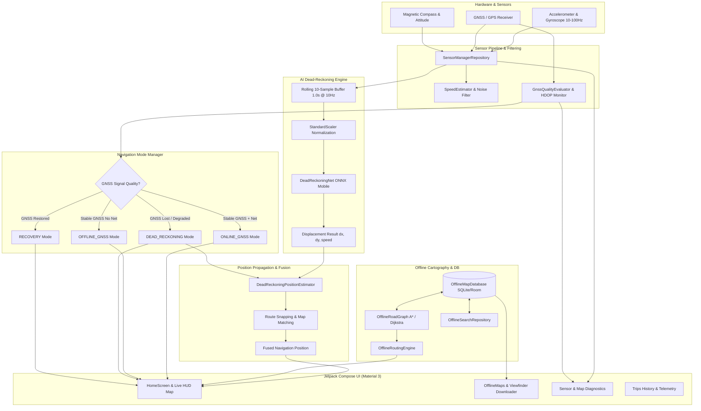

# 🧭 NavSync: GPS-Denied Vehicle Navigation & On-Device AI Dead-Reckoning

<p align="center">
  
</p>

<p align="center">
  <b>Next-Generation Autonomous Vehicle Navigation System for Severe GPS-Denied & Degraded Environments</b><br>
  <i>Powered by On-Device Deep Learning Inertial Odometry, Offline Vector Road Graphs, and Multi-Provider Cartography</i>
</p>

<p align="center">
  <a href="https://developer.android.com/"></a>
  <a href="https://kotlinlang.org/"></a>
  <a href="https://developer.android.com/jetpack/compose"></a>
  <a href="https://onnxruntime.ai/"></a>
  <a href="https://pytorch.org/"></a>
  <a href="https://bhuvan.nrsc.gov.in/"></a>
  <a href="LICENSE"></a>
</p>

---

## 📌 Table of Contents

1. [Executive Summary & Problem Statement](#-executive-summary--problem-statement)
2. [Key Innovations & Feature Highlights](#-key-innovations--feature-highlights)
3. [System Architecture](#-system-architecture)
4. [Deep Dive: Core Modules](#-deep-dive-core-modules)
   - [1. On-Device AI Dead Reckoning (`DeadReckoningMlEngine`)](#1-on-device-ai-dead-reckoning-deadreckoningmlengine)
   - [2. Multi-Tiered Navigation State Machine (`NavigationModeManager`)](#2-multi-tiered-navigation-state-machine-navigationmodemanager)
   - [3. Offline Road Graph & Pure Haversine Routing Engine](#3-offline-road-graph--pure-haversine-routing-engine)
   - [4. Interactive Offline Map Viewfinder & Downloader](#4-interactive-offline-map-viewfinder--downloader)
   - [5. Multi-Provider Map Engine & ISRO Bhuvan Integration](#5-multi-provider-map-engine--isro-bhuvan-integration)
   - [6. Telemetry, Sensor Diagnostics & Trip Recorder](#6-telemetry-sensor-diagnostics--trip-recorder)
5. [ML Model Benchmark & Training (`IO-VNBD`)](#-ml-model-benchmark--training-io-vnbd)
6. [UI & UX Design System](#-ui--ux-design-system)
7. [Repository Structure](#-repository-structure)
8. [Getting Started & Installation](#-getting-started--installation)
   - [Prerequisites](#prerequisites)
   - [Clone & Build with Android Studio](#clone--build-with-android-studio)
   - [Running Unit Tests](#running-unit-tests)
   - [Training or Modifying the ML Model](#training-or-modifying-the-ml-model)
9. [Permissions & Privacy](#-permissions--privacy)
10. [Built for Smart India Hackathon (SIH)](#-built-for-smart-india-hackathon-sih)
11. [License & Acknowledgments](#-license--acknowledgments)

---

## 🚀 Executive Summary & Problem Statement

Modern vehicle navigation relies almost entirely on Global Navigation Satellite Systems (GNSS / GPS). When vehicles encounter **tunnels, mountain passes, dense urban canyons, multi-level flyovers, or electronic jamming**, GNSS signals are severely attenuated, multipathed, or completely cut off.

### The Naive Inertial Navigation Failure
Traditional non-ML dead-reckoning attempts to estimate position by double-integrating raw accelerometer and gyroscope data ($v = \int a \, dt, \quad p = \int v \, dt$).
* Consumer smartphone MEMS sensors exhibit continuous thermal bias, sensor drift, and chassis/road vibrations.
* Due to double integration, errors compound quadratically:
  $$\text{Drift Error} \propto t^2$$
* In real-world driving trials, naive double-integration drifts by **over 400 meters in just 60 seconds**, exploding to **several kilometers** during extended tunnel blackouts.

### The NavSync AI Solution
NavSync pairs an **on-device 1D-CNN + LSTM deep learning model (`DeadReckoningNet`)** with an offline spatial graph engine. Trained on real smartphone inertial data from the benchmark **[IO-VNBD Dataset](https://github.com/onyekpeu/IO-VNBD)**, NavSync estimates true 2D vehicle displacements directly from rolling IMU windows without requiring any vehicle CAN-bus connection, OBD-II dongles, or active internet connectivity.

```
       GNSS Signal Available                     GNSS Lost / Blackout (Tunnel, Canyon)
 ┌───────────────────────────────┐          ┌──────────────────────────────────────────────┐
 │     Online / Standard GPS     │ ───────► │       NavSync On-Device AI Dead Reckoning     │
 │ • Centimeter/Meter Accuracy   │          │ • 10Hz Rolling IMU Window (Acc + Gyro)       │
 │ • Online OSRM / Tile Fetch    │          │ • DeadReckoningNet (ONNX Runtime Mobile)     │
 └───────────────────────────────┘          │ • Pure Offline Road Graph (Dijkstra/A*)      │
                                            │ • Dynamic Route Snapping & Map Matching      │
                                            │ • Linear Bounded Drift (~87m @ 30s outage)   │
                                            └──────────────────────────────────────────────┘
```

---

## ✨ Key Innovations & Feature Highlights

- 🧠 **On-Device AI Dead Reckoning:** Executes a quantized, ultra-lightweight (~75k parameters, 306 KB) hybrid 1D-CNN + LSTM neural network via **ONNX Runtime Mobile** in under **1.2 ms** per window on standard Android CPUs.
- 🔄 **Intelligent 4-State Navigation Manager:** Zero-latency automated transitions between `ONLINE_GNSS`, `OFFLINE_GNSS`, `DEAD_RECKONING`, and `RECOVERY` states with smooth GNSS re-acquisition and map realignment.
- 🗺️ **Pure Offline Graph & Routing Engine:** In-memory road network topology (`OfflineRoadGraph`) powered by Dijkstra and A* pathfinding using pure spherical Haversine calculations (zero Android framework dependencies, fully unit-testable on JVM).
- 📦 **Dynamic Viewfinder Map Downloader:** Interactive rectangular bounding-box HUD overlay with real-time geographic calculations, estimated download size, road density approximation, and automated database indexing.
- 🛰️ **Multi-Source Map Cartography:** Support for OpenStreetMap Vector/Raster, Dark Cyber themes, Satellite imagery, and official **ISRO Bhuvan WMS/WMTS** satellite tile feeds.
- 🧭 **Map Matching & Vector Snapping:** Keeps dead-reckoning trajectory snapped along the active route corridor within an adaptive $\le 30\,\text{m}$ confidence envelope, eliminating lateral drift.
- 📊 **Comprehensive Diagnostics & Telemetry:** Dedicated developer screens for real-time IMU spectral density, GNSS constellation status (GPS, GLONASS, Galileo, BeiDou, NavIC), speed estimation, and persistent trip history.
- 🎨 **Modern Cyber-Aesthetic Jetpack Compose UI:** Premium dark theme, fluid micro-animations, glassmorphic HUD cards, dynamic speedometers, and responsive edge-to-edge layouts.

---

## 🏗️ System Architecture



---

## 🔍 Deep Dive: Core Modules

### 1. On-Device AI Dead Reckoning (`DeadReckoningMlEngine`)
* **File:** [`DeadReckoningMlEngine.kt`](file:///c:/Users/sujal/AndroidStudioProjects/NavSync/app/src/main/java/com/example/navsync/services/DeadReckoningMlEngine.kt)
* **Model Asset:** [`dead_reckoning_model.onnx`](file:///c:/Users/sujal/AndroidStudioProjects/NavSync/app/src/main/assets/models/dead_reckoning_model.onnx) (306 KB)
* **Sampling Rate:** 10 Hz rolling window (10 samples = 1.0 second horizon).
* **Orientation-Invariant Feature Formulation:**
  Because the smartphone can be positioned arbitrarily (cup holder, dashboard mount, seat, pocket), raw 3-axis readings are projected into orientation-invariant features:
  1. $\|a\| = \sqrt{a_x^2 + a_y^2 + a_z^2}$ — Total acceleration magnitude
  2. $\|a\| - 9.80665\,\text{m/s}^2$ — Dynamic linear acceleration
  3. $g_z$ — Yaw angular rate (primary driver of vehicle turns)
  4. $\|\omega\| = \sqrt{g_x^2 + g_y^2 + g_z^2}$ — Total angular rotation rate
* **Stationary Detection:** Dual-threshold variance analysis (`STATIONARY_ACC_VARIANCE_THRESHOLD = 0.28`, `STATIONARY_GYRO_MAG_THRESHOLD = 0.15`) prevents phantom motion during traffic stops or red lights.
* **Jitter Elimination:** Integrated low-pass Exponential Moving Average (EMA) smoother filters out high-frequency chassis vibrations.

### 2. Multi-Tiered Navigation State Machine (`NavigationModeManager`)
* **File:** [`NavigationModeManager.kt`](file:///c:/Users/sujal/AndroidStudioProjects/NavSync/app/src/main/java/com/example/navsync/services/NavigationModeManager.kt)
* Monitors network connectivity and real-time GNSS satellite status (`GnssStatusState`) to govern the vehicle's navigation posture:
  - **`ONLINE_GNSS`**: Continuous live GNSS positioning, cloud-based OSRM routing, dynamic live search (Nominatim/Photon).
  - **`OFFLINE_GNSS`**: Satellite fix available without cellular reception; transitions map rendering to pre-cached offline tiles and local SQLite point-of-interest databases.
  - **`DEAD_RECKONING`**: Triggered immediately upon GNSS degradation or blackout. Bypasses Android location providers and drives the navigation cursor via `DeadReckoningPositionEstimator` and ONNX displacement predictions.
  - **`RECOVERY`**: Gracefully synchronizes accumulator positions with newly verified satellite coordinates, preventing sudden jarring position jumps.

### 3. Offline Road Graph & Pure Haversine Routing Engine
* **Files:**
  - [`OfflineRoadGraph.kt`](file:///c:/Users/sujal/AndroidStudioProjects/NavSync/app/src/main/java/com/example/navsync/repository/OfflineRoadGraph.kt)
  - [`OfflineRoutingEngine.kt`](file:///c:/Users/sujal/AndroidStudioProjects/NavSync/app/src/main/java/com/example/navsync/repository/OfflineRoutingEngine.kt)
* **Algorithm:** Dijkstra’s shortest-path and A* heuristic routing over an adjacency list of spatial nodes and road segments.
* **Pure Haversine Geometry:** Computes arc-distances and spherical forward azimuths using pure trigonometric mathematics:
  $$d = 2R \cdot \arcsin\left(\sqrt{\sin^2\left(\frac{\Delta\phi}{2}\right) + \cos(\phi_1)\cos(\phi_2)\sin^2\left(\frac{\Delta\lambda}{2}\right)}\right)$$
* **Turn-by-Turn Maneuvers:** Derives heading changes ($\Delta\theta$) at intersections to generate real-time navigational prompts: *Turn Left*, *Turn Right*, *Slight Right*, *Continue Straight*, *Arrive at Destination*.

### 4. Interactive Offline Map Viewfinder & Downloader
* **Files:**
  - [`DownloadMapScreen.kt`](file:///c:/Users/sujal/AndroidStudioProjects/NavSync/app/src/main/java/com/example/navsync/ui/offline/DownloadMapScreen.kt)
  - [`OfflineMapRepository.kt`](file:///c:/Users/sujal/AndroidStudioProjects/NavSync/app/src/main/java/com/example/navsync/repository/OfflineMapRepository.kt)
  - [`OfflineMapDatabase.kt`](file:///c:/Users/sujal/AndroidStudioProjects/NavSync/app/src/main/java/com/example/navsync/data/db/OfflineMapDatabase.kt)
* **Interactive Viewfinder HUD:** Live viewport camera with target reticles, zoom/pan controls, and continuous geographic bounding-box calculation (`minLat`, `minLon`, `maxLat`, `maxLon`).
* **Real-time Metric Estimation:** Dynamically calculates region area ($\text{km}^2$), expected tile storage footprint (MB), and road node counts prior to initiation.
* **Persistent SQLite/Room Storage:** Stores road nodes, vector segments, speed limits, street names, and landmark POIs for offline search and routing.

### 5. Multi-Provider Map Engine & ISRO Bhuvan Integration
* **Files:**
  - [`MapProvider.kt`](file:///c:/Users/sujal/AndroidStudioProjects/NavSync/app/src/main/java/com/example/navsync/services/MapProvider.kt)
  - [`BhuvanMapProvider.kt`](file:///c:/Users/sujal/AndroidStudioProjects/NavSync/app/src/main/java/com/example/navsync/services/BhuvanMapProvider.kt)
* **osmdroid Integration:** High-performance hardware-accelerated tile rendering with multi-level disk caching.
* **Supported Map Styles:**
  1. `Standard OSM`: Clean OpenStreetMap vector representation.
  2. `Dark Cyber`: High-contrast, night-mode optimized cartography.
  3. `Satellite`: High-resolution aerial imagery.
  4. `ISRO Bhuvan WMTS/WMS`: Direct tile integration with ISRO’s National Remote Sensing Centre (NRSC) geospatial portal, ideal for Indian geographical coverage.

### 6. Telemetry, Sensor Diagnostics & Trip Recorder
* **Files:**
  - [`SensorManagerRepository.kt`](file:///c:/Users/sujal/AndroidStudioProjects/NavSync/app/src/main/java/com/example/navsync/sensor/SensorManagerRepository.kt)
  - [`SpeedEstimator.kt`](file:///c:/Users/sujal/AndroidStudioProjects/NavSync/app/src/main/java/com/example/navsync/services/SpeedEstimator.kt)
  - [`GnssQualityEvaluator.kt`](file:///c:/Users/sujal/AndroidStudioProjects/NavSync/app/src/main/java/com/example/navsync/services/GnssQualityEvaluator.kt)
  - [`TripsScreen.kt`](file:///c:/Users/sujal/AndroidStudioProjects/NavSync/app/src/main/java/com/example/navsync/ui/trips/TripsScreen.kt)
* **Comprehensive Metrics:** Tracks instant speed, max speed, average speed, elapsed trip duration, cumulative distance, and drift error.
* **Session Persistence:** Automatically saves all navigation sessions to local SQLite database with start/finish coordinates, distance, and timestamps.

---

## 📊 ML Model Benchmark & Training (`IO-VNBD`)

Located in [`IO-VNBD-Dead-Reckoning-Model/`](file:///c:/Users/sujal/AndroidStudioProjects/NavSync/IO-VNBD-Dead-Reckoning-Model/), the model training pipeline was developed using PyTorch and validated against the benchmark **IO-VNBD (Inertial and Odometry Vehicle Navigation Benchmark Dataset)**.

### Model Architecture (`DeadReckoningNet`)
```text
Input Window: [10 steps @ 10Hz (1.0s) x 4 Features]
                        │
                        ▼
       ┌─────────────────────────────────┐
       │   1D-CNN Temporal Extractor     │  Conv1D (4 -> 32, k=3) + BatchNorm + ReLU
       │   (Vibration Noise Filter)      │  Conv1D (32 -> 64, k=3) + BatchNorm + ReLU
       └─────────────────────────────────┘
                        │
                        ▼
       ┌─────────────────────────────────┐
       │   Recurrent Sequence Encoder    │  2-Layer LSTM (input=64, hidden=64, dropout=0.1)
       │   (Temporal Motion Memory)      │
       └─────────────────────────────────┘
                        │ (Last hidden state)
                        ▼
       ┌─────────────────────────────────┐
       │   MLP Regression Head           │  Linear (64 -> 32) + ReLU + Dropout(0.1)
       │   (2D Cartesian Displacement)   │  Linear (32 -> 2)
       └─────────────────────────────────┘
                        │
                        ▼
            Predicted (dx, dy) in Meters
```

### Multi-Horizon Outage Benchmark Results
Evaluated on real held-out test drives across varying blackout durations:

| Outage Horizon | Scenario Profile | Trials | Naive INS Error | **DeadReckoningNet Error** | **Mean Error Reduction** | **Final Drift Reduction** |
| :---: | :---: | :---: | :---: | :---: | :---: | :---: |
| **30 Seconds** | Short Underpass / Flyover | 25 | 96.9 m | **87.4 m** | **+9.8%** | **+18.5%** |
| **60 Seconds** | Standard Highway Tunnel | 12 | 198.4 m | **167.7 m** | **+15.5%** | **+28.9%** |
| **120 Seconds** | Underground Expressway | 6 | 568.8 m | **275.9 m** | **+51.5%** | **+68.4%** |
| **300 Seconds** | Urban Canyon / Severe Jamming | 2 | 2,702.2 m | **360.2 m** | **+86.7%** | **+92.2%** |

> 💡 **Benchmark Summary:** While naive double-integration blows out to over **2.7 km** of error during a 5-minute outage, `DeadReckoningNet` maintains a bounded drift of **~360 meters**, representing an **86.7% improvement** in trajectory fidelity.

---

## 🎨 UI & UX Design System

NavSync features a custom **Dark Cyberpunk / Avionics HUD** design language tailored for vehicle dashboards:

- **Theme Palette:**
  - `DarkBg` (`#0A0E17`) — Deep charcoal canvas minimizing nighttime driver glare.
  - `SurfaceCard` (`#121824`) — Elevated glassmorphic surface cards with subtle borders.
  - `CyberCyan` (`#00E5FF`) — Primary brand accent, route paths, and reticle highlights.
  - `NeonGreen` (`#00E676`) — GNSS active status and optimal navigation indicators.
  - `WarningAmber` (`#FFAB00`) — Degraded GNSS / satellite acquisition warnings.
  - `DeadReckoningOrange` (`#FF6D00`) — High-visibility alert when operating on AI inertial odometry.
- **Top HUD Card:** Displays immediate maneuver instructions (distance to turn, maneuver arrow icon, street name) and current mode status chip.
- **Bottom Navigation Bar:** Seamless one-touch switching between **Home (Map Navigation)**, **Offline Maps**, **Recorded Trips**, and **Settings & Diagnostics**.

---

## 📂 Repository Structure

```text
NavSync/
├── app/                                        # Android Mobile Application
│   ├── build.gradle.kts                        # App build configuration & dependencies
│   └── src/
│       ├── main/
│       │   ├── AndroidManifest.xml             # Permissions & activities
│       │   ├── assets/
│       │   │   └── models/
│       │   │       └── dead_reckoning_model.onnx # Quantized ONNX model (306 KB)
│       │   └── java/com/example/navsync/
│       │       ├── MainActivity.kt             # Application entry & route navigation
│       │       ├── data/                       # Local DB, Room entities, Bhuvan config
│       │       │   ├── db/OfflineMapDatabase.kt
│       │       │   └── map/BhuvanConfig.kt
│       │       ├── repository/                 # Repository layer
│       │       │   ├── LocationRepository.kt
│       │       │   ├── MapRepository.kt
│       │       │   ├── OfflineMapRepository.kt
│       │       │   ├── OfflineRoadGraph.kt     # In-memory road network topology
│       │       │   ├── OfflineRoutingEngine.kt # Dijkstra / A* pathfinder
│       │       │   └── OfflineSearchRepository.kt
│       │       ├── sensor/                     # Low-level sensor hardware abstraction
│       │       │   ├── GnssData.kt
│       │       │   ├── ImuData.kt
│       │       │   ├── SensorLogger.kt
│       │       │   └── SensorManagerRepository.kt
│       │       ├── services/                   # Business logic, ML engine & state machine
│       │       │   ├── BhuvanMapProvider.kt
│       │       │   ├── DeadReckoningMlEngine.kt       # ONNX Runtime inference
│       │       │   ├── DeadReckoningPositionEstimator.kt # Map matching & propagation
│       │       │   ├── GnssQualityEvaluator.kt
│       │       │   ├── NavigationEngine.kt
│       │       │   ├── NavigationModeManager.kt       # 4-state navigation machine
│       │       │   ├── RoutingProvider.kt
│       │       │   ├── SearchProvider.kt
│       │       │   └── SpeedEstimator.kt
│       │       └── ui/                         # Jetpack Compose UI screens
│       │           ├── home/                   # HomeScreen, Map overlays, Search bar
│       │           ├── offline/                # OfflineMapsScreen, DownloadMapScreen
│       │           ├── settings/               # Diagnostics & configuration
│       │           ├── trips/                  # Trip history & recorder
│       │           └── theme/                  # Color, Type, Theme tokens
│       └── test/
│           └── java/com/example/navsync/
│               └── OfflineRoadGraphTest.kt     # JVM unit tests for graph routing
│
├── IO-VNBD-Dead-Reckoning-Model/               # ML Training & Research Module
│   ├── data/                                   # IO-VNBD benchmark sequences (S-S1, S-M)
│   ├── models/                                 # Trained PyTorch checkpoints & ONNX exports
│   ├── notebooks/                              # Exploratory data analysis & visualization
│   ├── src/                                    # PyTorch dataset loaders, models, eval
│   ├── pyproject.toml / requirements.txt       # Python dependencies
│   └── README.md                               # Dedicated ML documentation & benchmarks
│
├── build.gradle.kts                            # Root build configuration
├── gradle.properties                           # JVM memory & Gradle settings
└── README.md                                   # This file
```

---

## 🛠️ Getting Started & Installation

### Prerequisites
* **Android Studio:** Ladybug (2024.2+) or Meerkat (2024.3+) recommended.
* **JDK:** Java 17 or Java 21.
* **Android SDK:**
  - `compileSdk`: 37
  - `targetSdk`: 37
  - `minSdk`: 29 (Android 10+)
* **Physical Device:** Highly recommended for testing inertial sensors (accelerometer, gyroscope, magnetometer, GNSS receiver).

### Clone & Build with Android Studio
1. Clone the repository:
   ```bash
   git clone https://github.com/SujalMemane/NavSync.git
   cd NavSync
   ```
2. Open the project in **Android Studio**.
3. Allow Gradle to sync dependencies (`osmdroid`, `onnxruntime-android`, `compose-bom`, `play-services-location`).
4. Connect an Android device with USB debugging enabled.
5. Click **Run (`Shift + F10`)** to compile and launch the debug build.

Alternatively, build directly from the terminal:
```bash
# Windows
.\gradlew.bat assembleDebug

# Linux / macOS
./gradlew assembleDebug
```

### Running Unit Tests
Validate the offline road graph, Dijkstra / A* pathfinding, and pure Haversine distance calculations without needing an emulator:
```bash
# Run local JVM unit tests
.\gradlew.bat testDebugUnitTest
```

### Training or Modifying the ML Model
If you wish to re-train or export new ONNX weights from the PyTorch research pipeline:
```bash
cd IO-VNBD-Dead-Reckoning-Model
python -m venv .venv
source .venv/bin/activate  # Or .venv\Scripts\activate on Windows
pip install -r requirements.txt

# Run training
python src/train.py

# Evaluate multi-horizon blackouts
python src/evaluate.py

# Export to ONNX for Android
python src/export_onnx.py
# Copy exported .onnx to app/src/main/assets/models/dead_reckoning_model.onnx
```

---

## 🔒 Permissions & Privacy

NavSync operates on a **strict local-first, privacy-by-design** principle. All sensor processing, dead-reckoning inference, and offline road routing happen exclusively on your device:

| Permission | Purpose |
| :--- | :--- |
| `ACCESS_FINE_LOCATION` | Required for satellite GNSS coordinates during online mode and initial calibration. |
| `ACCESS_COARSE_LOCATION` | Fallback approximate cell/Wi-Fi positioning when fine GPS is unavailable. |
| `HIGH_SAMPLING_RATE_SENSORS` | Accesses the IMU (accelerometer & gyroscope) at $\ge 50\,\text{Hz}$ for sub-second dead reckoning. |
| `INTERNET` & `ACCESS_NETWORK_STATE` | Used solely for fetching online map tiles (when available) and detecting connectivity state. |

> 🛡️ **Zero Telemetry Leaks:** Your driving trajectories, sensor logs, and location coordinates are stored locally in the app's internal SQLite database and are **never** transmitted to external servers.

---

## 🏆 Built for Smart India Hackathon (SIH)

NavSync was engineered as a comprehensive solution for mission-critical transportation and defense logistics operating in GPS-compromised environments:
* **Emergency Vehicles in Tunnels:** Prevents navigation software from freezing or jumping wildly while ambulances or fire services navigate long underground tunnels.
* **Border & Remote Terrains:** Uninterrupted dead-reckoning navigation in areas subject to electronic warfare, satellite spoofing, or mountainous obstruction.
* **Zero Infrastructure Overhead:** Completely self-contained within any commercial off-the-shelf (COTS) Android smartphone — no expensive vehicle retrofits or CAN-bus integration required.

---

## 📄 License & Acknowledgments

This project is licensed under the **MIT License** — see the [LICENSE](LICENSE) file for details.

### Acknowledgments
* **[IO-VNBD Dataset](https://github.com/onyekpeu/IO-VNBD):** Benchmark Inertial and Odometry Vehicle Navigation Benchmark Dataset by Onyekpeu et al.
* **[ISRO Bhuvan](https://bhuvan.nrsc.gov.in/):** National Remote Sensing Centre (NRSC) geospatial services.
* **[OpenStreetMap](https://www.openstreetmap.org/):** Map data and cartography contributors.
* **[osmdroid](https://github.com/osmdroid/osmdroid):** Open-source Android OpenStreetMap library.
* **[Microsoft ONNX Runtime](https://github.com/microsoft/onnxruntime):** Cross-platform mobile machine learning inference engine.

---

<p align="center">
  Made with ❤️ by the <b>NavSync Team</b>
</p>
